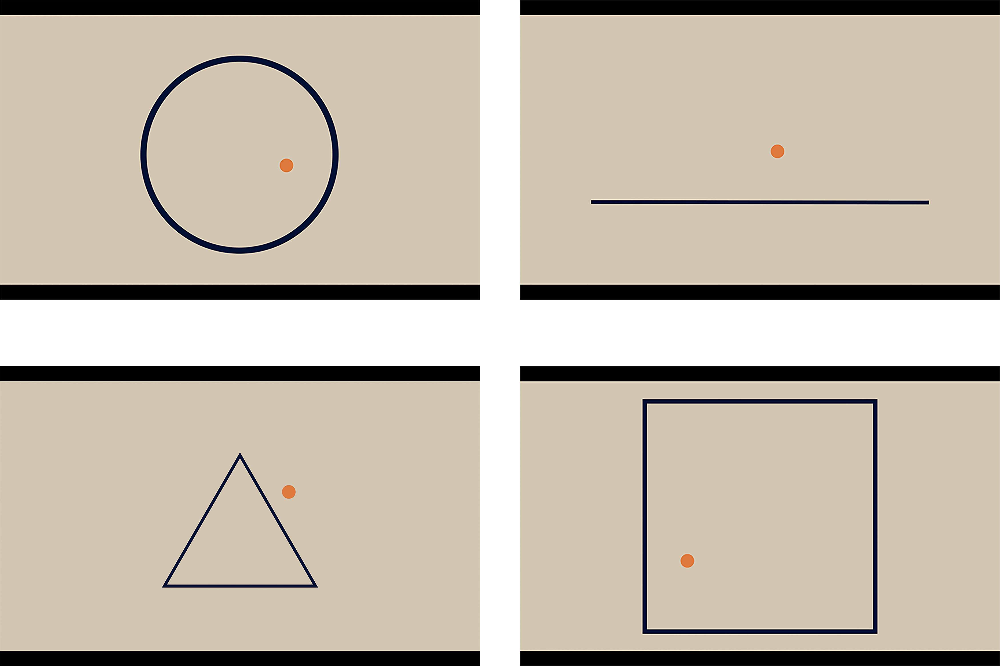
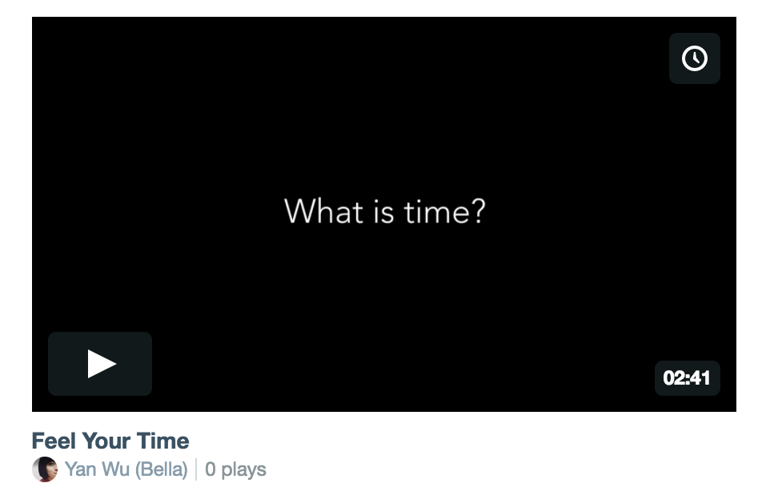
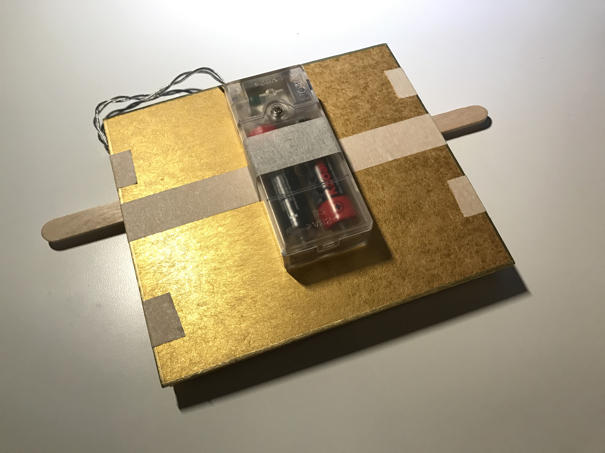
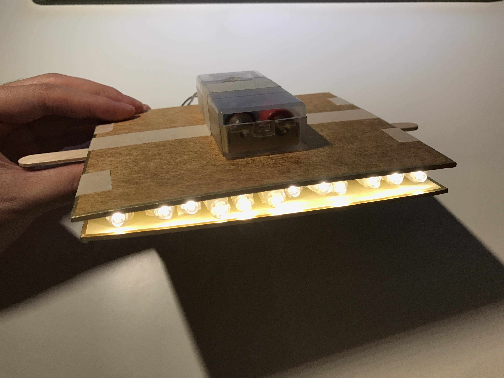
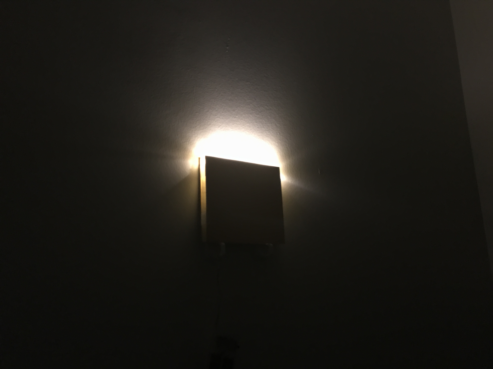
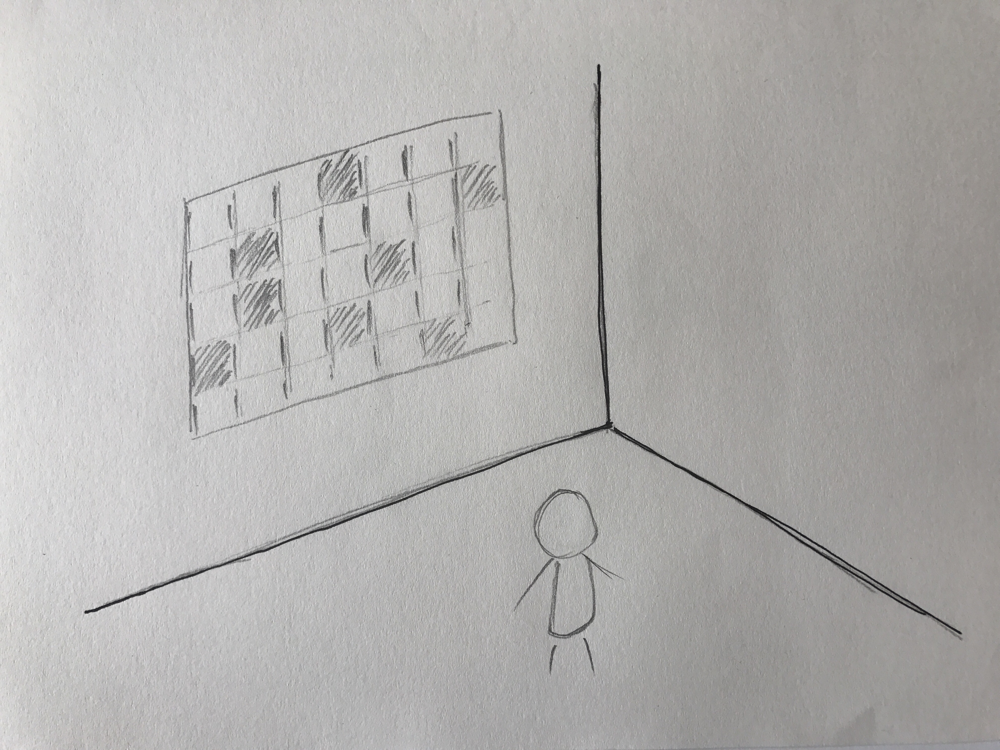

# 2D & 3D
## Central Concept:bulb:

Basically, I am still working on what I had explored in my *"5-in-5 Assignment"* as well as my *"1D Narratives"*, that is

#### :question:What kinds of role our senses play during the formation of our cognition, like when we are learning a new thing, or in a new environment:question:

But, based on the feedbacks I got from the class & Fei about my *"1D Narratives"*, I decided to jump out of the circle of "children" and switch my focus to ordinary people, just like everyone.

And maybe it's because the project we are exploring is called *"Ideas in Form"*, I realized that when we are talking about "sense", it must be something tangible, like it can either be seen, be heard, or be touched, be smelled. Then, what aboue something that is intangible? Like time.

## 2D - *Feel Your Time*

#### How do we perceive time?

Seldom do people think about this question as the answer seems apparent. But when you think about it again, it is difficult.

#### Time is nowhere, time is everywhere.

#### It could be long, it could be short.

In this case, I created a series of motion graphics with a moving ball and basic geometric figures trying to let people feel the time.

My preliminary idea was to build an interactive installation in which there should be 4 screens on the wall displaying one of the four motion graphics. Viewers will be given a paper and a pencil and asked to write down the time they feel about each periodic movement.

:point_right: [Click here to see the demo video](https://vimeo.com/234332936)

## 3D - *Time Wall*

In 3D I considered to give time a shape. I was thinking about how could we make time visible, like a real object.

So I created a *Time Wall* made up of several *Time Bricks*. Every brick represents *A Day* and will rotate according to the real time.

